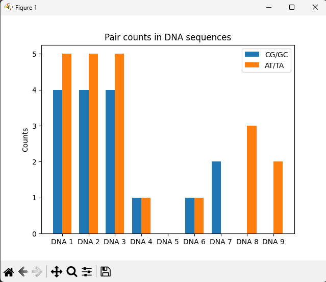

# Analyse des séquences d’ADN

Le programme a compté le nombre de paires **CG/GC** et **AT/TA** dans plusieurs séquences d’ADN issues du fichier `DNAFile.txt`.  

Certaines séquences montrent un équilibre relatif entre les deux types de paires (cas **1–4, 6**).  
D’autres séquences sont spécialisées dans un type de paire (**CG-rich** ou **AT-rich**).  

Le graphique **`resultats.png`** permet de comparer visuellement les profils des différentes séquences.

---

## Résultats par séquence

- **Séquences 1 à 3**  
  → Équilibre similaire : `4` paires **CG/GC** et `5` paires **AT/TA**  
  → ~44% CG/GC et 56% AT/TA  

- **Séquence 4** (`ATCG`)  
  → 1 paire de chaque type → proportions équilibrées **50/50**  

- **Séquence 5** (`AAAAA`)  
  → Aucune paire valide détectée → **0%** pour les deux catégories  

- **Séquence 6** (`ATXBGC`)  
  → Présence de caractères invalides (`X`, `B`), mais ignorés  
  → Résultat : `1` paire CG/GC et `1` paire AT/TA (**50/50**)  

- **Séquence 7** (`CGCG`)  
  → Composée uniquement de paires **CG/GC** → **100% CG/GC**  

- **Séquence 8** (`ATATAT`)  
  → Composée uniquement de paires **AT/TA** → **100% AT/TA**  

- **Séquence 9** (`GATTACA`)  
  → `2` paires **AT/TA** → **100% AT/TA**

---

## Explication du code

### 1. Fonction `count_pairs(dna: str)`
- Parcourt la séquence **lettre par lettre**  
- Vérifie les couples consécutifs de bases :  
  - Si le couple est **CG** ou **GC** → incrémente le compteur **CG/GC**  
  - Si le couple est **AT** ou **TA** → incrémente le compteur **AT/TA**  
- Les paires valides sont comptées deux par deux (on saute à la base suivante après détection)  
- Les caractères invalides (≠ A, T, G, C) sont **ignorés**  

### 2. Lecture du fichier `DNAFile.txt`
- Chaque ligne correspond à une séquence d’ADN  
- On applique `count_pairs` à chaque séquence  

### 3. Affichage des résultats
- Pour chaque séquence : affichage des **comptes** et des **pourcentages** de chaque type de paire  

### 4. Visualisation avec Matplotlib
- Résultats regroupés dans deux listes : `cg_counts` et `at_counts`  
- Un histogramme est tracé :  
  - Barre **bleue** = CG/GC  
  - Barre **orange** = AT/TA  
- Permet une **comparaison rapide** entre séquences  

---

## Visualisation

